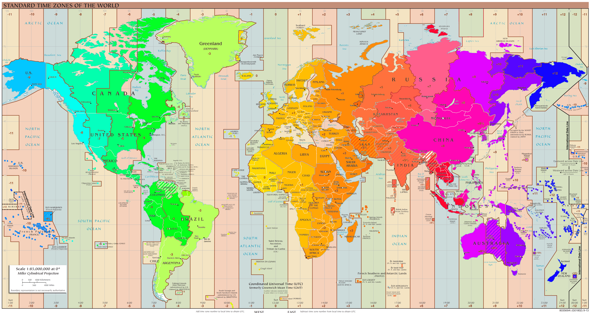

# World-TimeZones-color-circle
It's just a map of timezones, but all colors are from [color circle](https://color.adobe.com/build2.0.0-buildNo/resource/img/kuler/color_wheel_730.png). So timezones that are 'near' have also colors that are 'near'. So you can visually detect: how far are time zones?

It's based on [the file](https://en.wikipedia.org/wiki/File:Standard_World_Time_Zones.png) from wikipedia.

